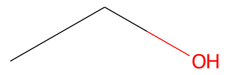
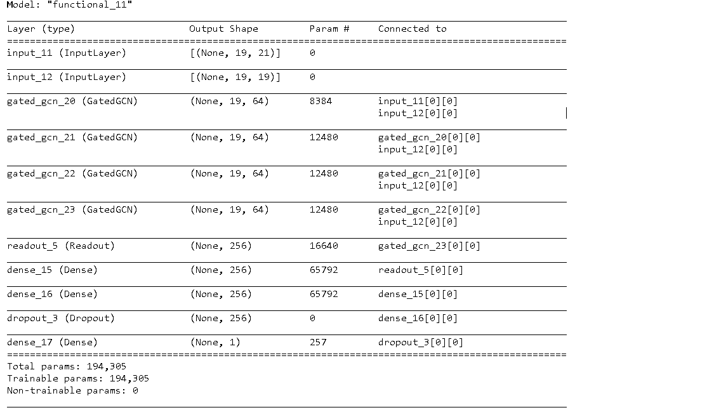
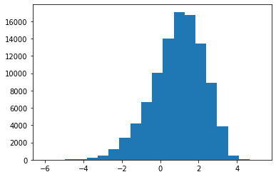

# regression-of-logP-with-GatedGCN

使用GatedGCN來預測化合物之logP，輸入代表結構的相鄰矩陣和對應原子的特徵，來預測辛醇/水分佈係數logP。logP越大，則化合物越親油，反之，越小則越溶水。預測的logP值來源於ZINC Datase (https://zinc.docking.org/)
    
經過50 epochs訓練，測試集MSE可達0.009。

## Model with GatedGCN 

GCN全名為Graph Convolutional Neural network，是將神經網路內部輸入代表結構的相鄰矩陣，矩陣上每一行代表某個頂點和其他頂點連接的情形。以乙醇為例:



```
# 相鄰矩陣 
A = array([[0, 1, 0],   # H3C- 
           [1, 0, 1],   #-CH2-
           [0, 1, 0]],) # -OH
```

可發現位於中間的碳原子，前後各接著碳和氧，兩端原子只接著一個中間的碳原子。

```
# 特徵矩陣
X = array([[ H3C- feature],   
           [-CH2- feature],   
           [ -OH  feature],)
# 使用矩陣乘法，結合特徵矩陣和相鄰矩陣
A X = array([[-CH2- feature              ],
             [ H3C- feature + -OH feature], 
             [ -OH  feature              ],)
```

相鄰矩陣可以得到周圍連結頂點的資訊，例如使用矩陣乘法，結合特徵矩陣和相鄰矩陣，即可得到所有相鄰頂點的和。

GatedGCN則可以更進一步透過，計算相鄰頂點的特徵和原頂點的特徵，以求出閥值來聚合周圍頂點的特徵。能具有選擇性的聚合使得能力更上一層。

```
class GatedGCN(Layer):
    def __init__(self, units=32, **kwargs):
        super().__init__()
        self.units = units

    def call(self, input_X, input_A):
        new_X = self.dense_n(input_X)
        new_X = tf.sparse.sparse_dense_matmul(input_A, new_X)
        
        X1 = self.dense_gate_i(input_X)
        X2 = self.dense_gate_n(new_X)
        gate_coefficient = tf.nn.sigmoid(X1 + X2)

        if(self.units != self.inp_dim):
            input_X = self.dense_i(input_X)
            
        output_X = tf.multiply(new_X, gate_coefficient) + tf.multiply(input_X, 1.0-gate_coefficient)        
        
        return output_X
```

以下為神經網路模型，使用GatedGCN聚合特徵，ReadOut聚合整個分子的所有特徵，最後連結Multilayer perceptron輸出logP值。



## Data Processing

先確認logP的範圍，其範圍變化不算高，直接採用為預測值。



各原子特徵使用原子種類、周圍氫原子數、有無在aromatic ring上、Hydrogen bond number。

```
def atom_feature(atom):
    features =  list(map(lambda s: int(atom.GetDegree() == s), [1, 2, 3, 4])) + \
                list(map(lambda s: int(atom.GetTotalNumHs() == s), [0, 1, 2, 3])) + \
                list(map(lambda s: int(atom.GetImplicitValence() == s), [0, 1, 2, 3,])) + \
                list(map(lambda s: int(atom.GetSymbol() == s), ['C', 'N', 'O', 'S', 'F', 'Cl', 'Br','I',])) + \
                [atom.GetIsAromatic()]
    return np.array(features)
```

將所有資料分成十等分，前八等分為訓練集，各一等分為測試集和驗證集。

## Training and Testing

經過50 epochs訓練，訓練集MSE為0.013，測試集MSE可達0.009，代表模型預測良好。

```
# 訓練集和驗證集
Epoch:0   Loss:0.364   val_Loss:0.192
Epoch:1   Loss:0.126   val_Loss:0.102
Epoch:2   Loss:0.089   val_Loss:0.067
......
Epoch:48   Loss:0.013   val_Loss:0.009
Epoch:49   Loss:0.013   val_Loss:0.008

# 測試集
test_Loss:0.009
```


